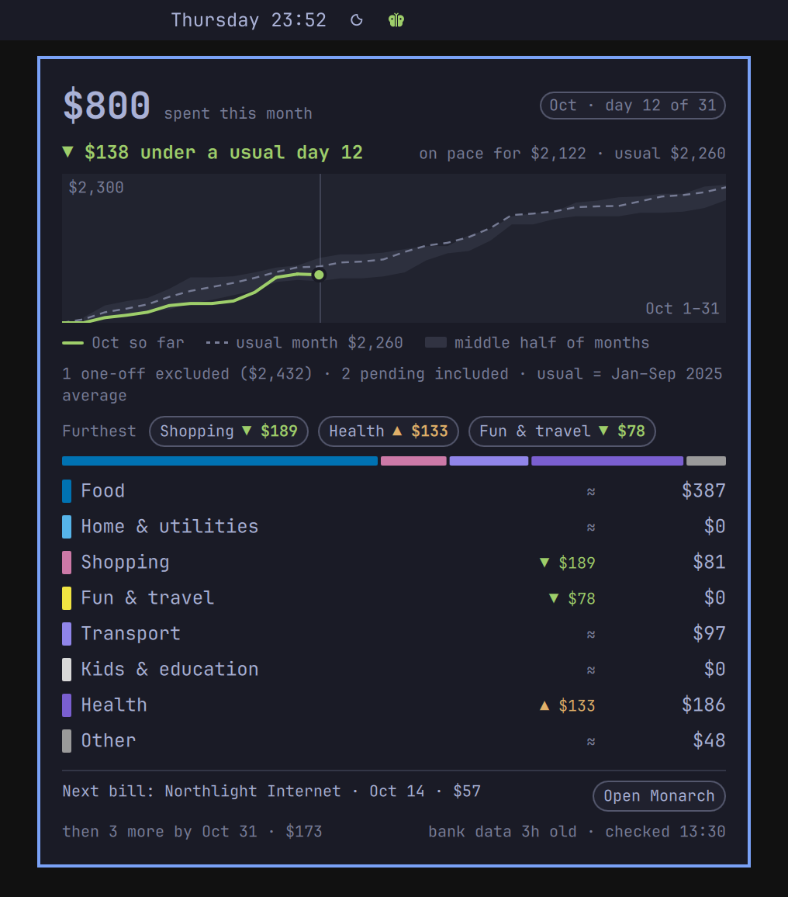
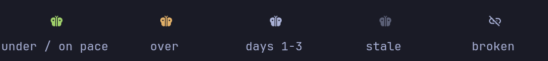
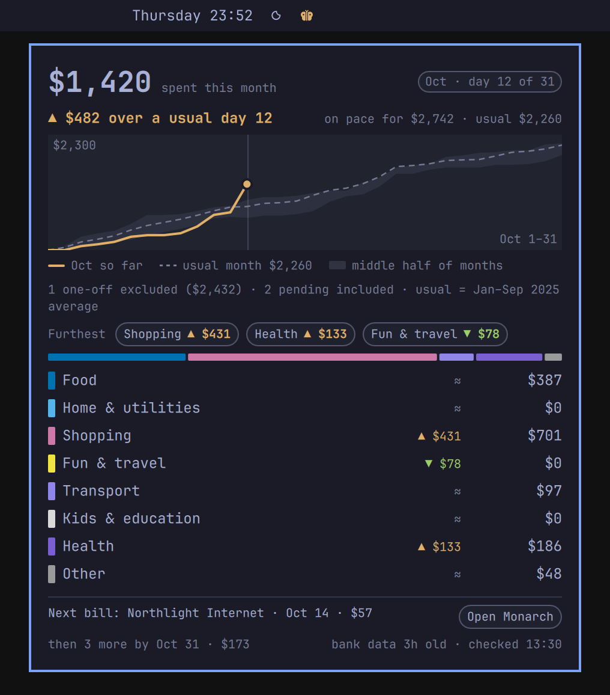
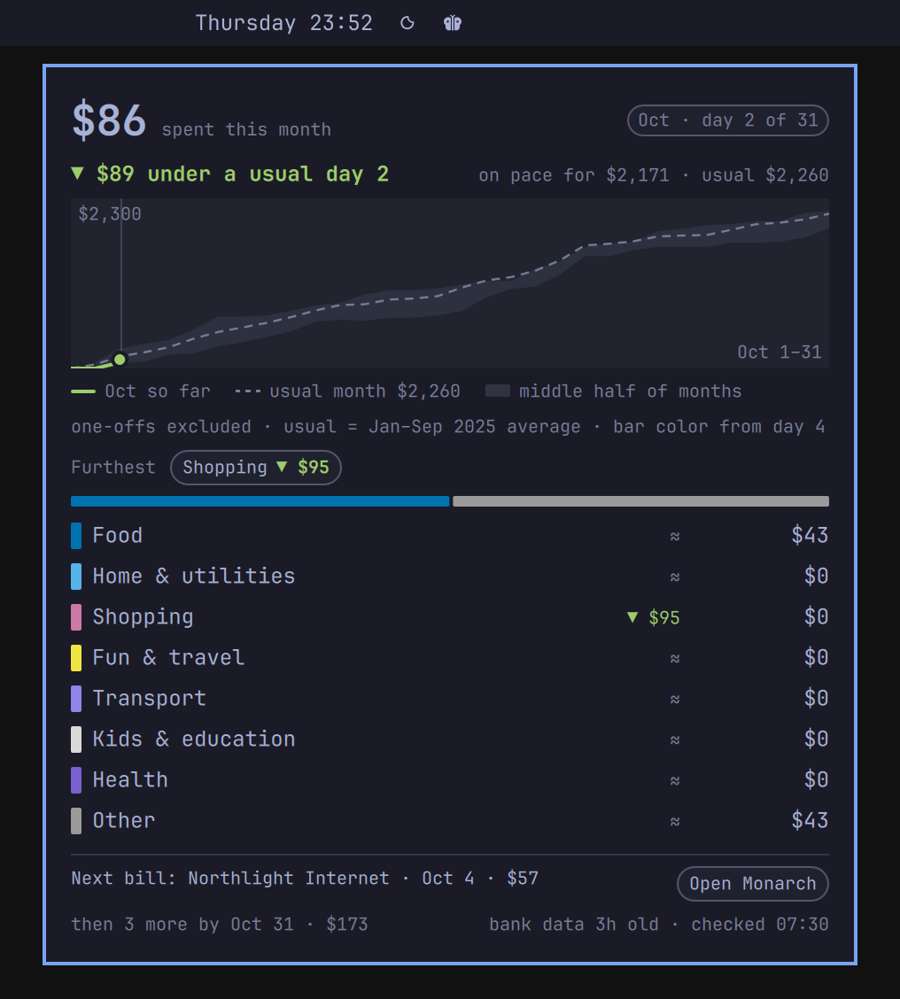
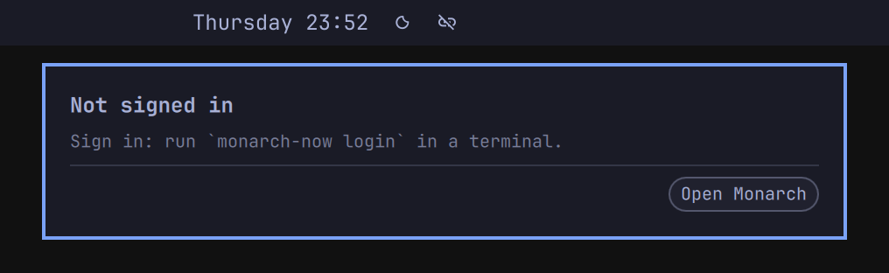
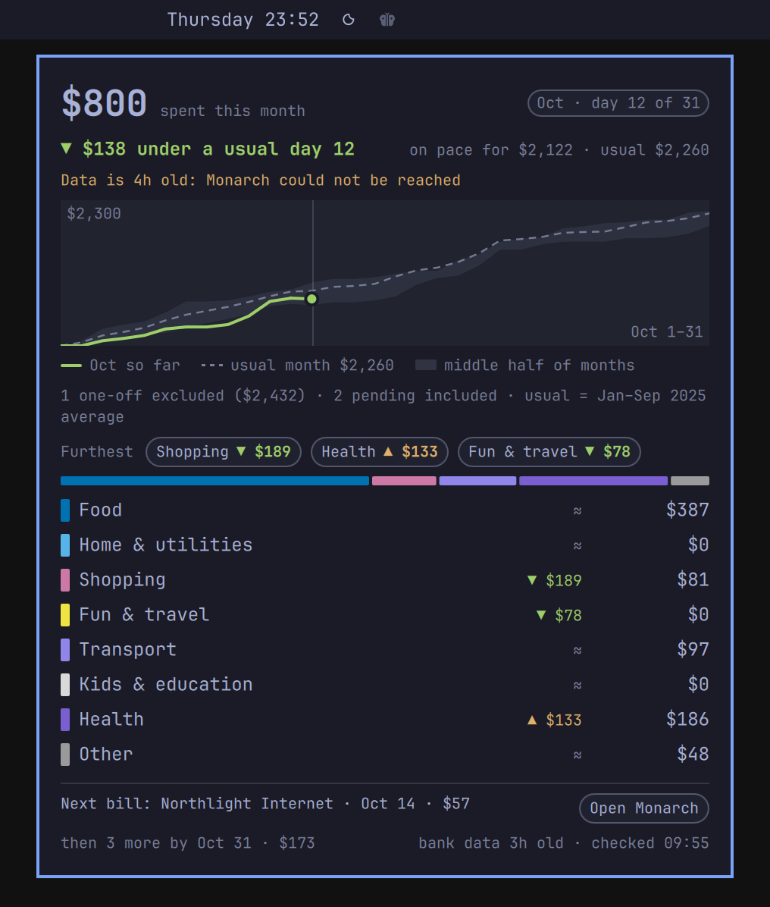

# Pupa

Pupa is a starting stage. Fork it, and what it becomes is yours.

**Pupa: Monarch Money on your Omarchy bar.** One butterfly, tinted by how this month's spending
is going against *your own* usual month. Hover it for a card with the whole picture; click it to
open Monarch. It only ever reads.



*Every screenshot here is rendered from an invented household (`tools/demo.py`). No real
account, merchant or amount appears anywhere in this repository.*

> **Unofficial.** Pupa is not affiliated with, endorsed by, or supported by Monarch Money.
> - It talks to Monarch through an **unofficial API** (the web app's own endpoint, via the
>   community client [`monarchmoneycommunity`](https://pypi.org/project/monarchmoneycommunity/)).
>   Monarch can change it at any time, and Pupa can break without warning.
> - It is **read-only and never writes to your account**. Every request is a query, and a guard
>   refuses anything else before it is sent.
> - **Your session stays in your local keyring.** It is never written to a file, a log, the
>   clipboard or anything that leaves your machine.
>
> "Monarch" and "Monarch Money" are trademarks of their owner. Use Pupa at your own risk and in
> line with Monarch's terms.

## What you get


- **On the bar:** a butterfly and nothing else. Never a number, so a glance at your bar in a
  meeting gives nothing away.
- **On hover:** this month so far, the pace line (`▼ $138 under a usual day 12`), where the month
  is heading, a chart against your usual month, the three spending groups furthest from usual,
  every group with its own figure, the next recurring bill, and how fresh the bank data is.
- **On click:** Monarch opens, or comes to the front if it is already open. Middle click fetches
  fresh data now.

## What the colors mean



| On the bar | Meaning |
|---|---|
| Green butterfly | Spending so far is **under or on** your usual pace for this day of the month. |
| Amber butterfly | You are **over** your usual pace. Amber, never red: it is a nudge, not an alarm. |
| Neutral butterfly (the bar's own color) | **Days 1–3 of a month**, the grace period: a single charge would decide the color, so the bar waits. The card still shows every figure and says "bar color from day 4". Also shown while there is no complete month of history to compare with. |
| Greyed butterfly | The data is **more than 3 hours old** (Monarch could not be reached). The card says how old and why. |
| Broken-link glyph | **Nothing trustworthy to show:** signed out, no data yet, or data older than 36 hours. Hover it to read why. |

Inside the card the same two colors mark each figure: green under usual, amber over. Nothing on
the card is ever red. "Over" needs a margin: within $25 (or 0.5 % of your usual month, if that
is more) the card reads "≈ on a usual month's pace" and stays green.

| | |
|---|---|
|  |  |

## Install (Omarchy)

**You need:** Omarchy with `omarchy-shell` (Omarchy 4 or newer), Python 3.11+, `secret-tool`
(the `libsecret` package) with a running keyring, and Chrome or Chromium for signing in. A stock
Omarchy install has all of these. If something is missing:

```bash
sudo pacman -S --needed python libsecret chromium
```

`uv` is used when it is on your PATH (`mise use -g uv`); otherwise the installer falls back to
`python -m venv` and `pip`.

**1. Add the plugin.** It lands in `~/.config/omarchy/plugins/pupa.monarch/`, disabled.

```bash
omarchy plugin add https://github.com/nathankramm/omarchy-monarch-money.git
```

Or by hand: `git clone https://github.com/nathankramm/omarchy-monarch-money.git ~/.config/omarchy/plugins/pupa.monarch`
followed by `omarchy-shell shell rescanPlugins`.

**2. Install the engine.** This builds a private Python environment in
`~/.local/share/monarch-now/venv` from `engine/requirements.txt` (every package pinned and
checked by hash), copies the engine beside it, and puts the `monarch-now` command in
`~/.local/bin`. No root, nothing outside your home directory.

```bash
~/.config/omarchy/plugins/pupa.monarch/install.sh
```

**3. Sign in.** A browser window opens on Monarch's own sign-in page, in a throwaway profile.
Sign in the way you always do (password, Google or Apple, two-factor included). When your
dashboard appears the window closes by itself and the session is in your keyring.

```bash
monarch-now login
```

**4. Put the butterfly on the bar.**

```bash
omarchy plugin enable pupa.monarch
```

It starts in the center section; `omarchy bar move` puts it elsewhere. The first fetch takes a
few seconds; after that the bar reads its cache and asks Monarch at most once an hour.

**See it before you sign in.** After step 4, this paints an invented household on your bar for
the current shell session (other scenes: `over`, `grace`, `stale`, `reconnect`, `new`,
`signed-out`):

```bash
omarchy-shell pupa.monarch fixture "python3 ~/.config/omarchy/plugins/pupa.monarch/tools/demo.py under"
omarchy-shell pupa.monarch fixture off     # back to your own data
```

If the butterfly does not change within a couple of seconds, the engine was in the middle of a
run when the command arrived: send it again.

**Updating:** `omarchy plugin update pupa.monarch`, then run `install.sh` again.

### Optional: the Monarch web app

Out of the box, a click opens `https://app.monarch.com` in your default browser. If you would
rather have Monarch as its own window, the way Omarchy does web apps:

```bash
~/.config/omarchy/plugins/pupa.monarch/install-webapp.sh
```

This calls Omarchy's own `omarchy-webapp-install` to create a "Monarch" web app
(`~/.local/share/applications/Monarch.desktop`). From then on the butterfly and the card's
"Open Monarch" button open that window, or focus it when it is already open. The web app's icon
is Monarch's own; the script downloads it from Monarch at install time and it is not part of
this repository. Undo with `omarchy-webapp-remove Monarch`. If you already have a web app named
"Monarch", Pupa simply uses it.

## Configure

Everything works without a config file. To change something, copy the example and edit it:

```bash
mkdir -p ~/.config/monarch-now
cp ~/.config/omarchy/plugins/pupa.monarch/config.example.toml ~/.config/monarch-now/config.toml
```

| Key | Default | What it does |
|---|---|---|
| `pace_grace_days` | `3` | On days 1 to N of a month the butterfly stays neutral. `0` turns the grace period off. |
| `one_off_tag` | `"One-off"` | The Monarch tag you put on purchases that should not move your monthly pace (a new roof, a wedding gift). They are left out of this month and of the usual month, and the card's note counts them. `""` if you have no such tag. |
| `excluded_tags` | `[]` | More tags to leave out entirely, for money you get back (reimbursed work expenses, say). |
| `usual_since` | not set | The earliest month your usual month may use, as `"YYYY-MM"`. For when your older months are not worth comparing with. Not set: the newest twelve complete months. |
| `[[groups]]` | eight everyday groups | The rows of the card: up to eight groups, each a list of Monarch category names, in the order you want them. The last group also takes every category you did not list. |

The example file explains each key and lists the default groups in full. A value the engine
cannot use is never guessed at: the default stays in force and `monarch-now status` says why.

**Your "usual month" is computed, not typed in.** It comes from your own Monarch history: the
average of your complete months, the newest twelve at most. The month in which your history
starts part-way is left out, `usual_since` can move the start later, and the card's note names
the months that were used (`usual = Jan–Sep 2025 average`). With no complete month yet, the
butterfly stays neutral and the card says so.

The widget itself has four settings (Setup > Plugins, or the widget's entry in
`~/.config/omarchy/shell.json`): `faceExec` (the engine command), `faceInterval` (seconds
between ticks, default 300), `faceHover` (`card` or a plain `text` tooltip) and `faceTint`
(`false` keeps the butterfly in the bar's own color).

## How it counts

- **Spending** is every transaction whose category belongs to an *expense-type* category group
  in Monarch, that is not hidden from reports, and that carries none of your excluded tags.
  Transfers, credit card payments and income fall out by type. Refunds net off. Pending
  transactions count, and the note says how many.
- **The pace** compares what you have spent through today with what your usual month had spent
  through the same day number. The headline says so: "over a usual day 12".
- **"On pace for"** is your usual month's total plus today's difference.
- The engine does all the arithmetic and formatting and prints one line of JSON; the QML only
  paints it. If the engine prints nothing readable, the bar shows the broken-link glyph rather
  than a stale or plausible-looking butterfly.

## Commands

```text
monarch-now login          sign in (browser window); --paste is a fallback that reads a Cookie header
monarch-now logout         forget the session
monarch-now status         what the engine knows: session, data age, face, config. No amounts.
monarch-now check FROM TO  spending for a date range by Pupa's rule, with what was left out;
                           set it beside a Monarch report with the same filters (YYYY-MM-DD)
monarch-now --refresh      fetch now (at most once a minute)

omarchy-shell pupa.monarch status     the widget's state as JSON (no amounts)
omarchy-shell pupa.monarch refresh    same as a middle click
```

## Troubleshooting

**A broken-link glyph instead of a butterfly.** Hover it: the card says what is wrong.

- *"Not signed in"* or *"Monarch signed this session out"*: your session has expired or was
  never stored. Log in again:
  ```bash
  monarch-now login
  ```
  The butterfly comes back on the next tick. How long a session lasts is up to Monarch.
- *"The keyring could not be read"*: your keyring is locked or not running. Unlock it (log in to
  your desktop session normally), then `monarch-now --refresh`.
- *"Monarch could not be reached"* / *"Monarch's answer changed shape"*: a network problem, or
  the unofficial API changed. The engine retries by itself; if "changed shape" persists, the
  client needs an update. Check this repository's issues.
- *"Monarch feed unavailable"*: the engine itself did not run. Run `monarch-now status` in a
  terminal; if the command is missing, run `install.sh` again.



**A greyed butterfly.** The last successful fetch is more than three hours old. The card's
banner gives the reason; it clears by itself when Monarch answers again.



**A neutral butterfly after day 3.** There is no complete month to compare with yet (Pupa needs
one), or `faceTint` is off.

**A figure looks wrong.** Run `monarch-now status`. An `unmapped` line lists Monarch categories
that none of your groups names (they are counted in the last group). A `config` line means a
config value was not used. Then compare `monarch-now check FROM TO` with a Monarch report.

**The card did not change after editing the QML.** `omarchy restart shell`.

## Privacy and security

- **Read-only, twice over.** The engine sends five GraphQL documents, all queries, all in
  `engine/monarchnow/adapter.py`. Every document is parsed before it is sent and anything that
  is not a query is refused; the client's login, upload and session-file paths are disabled.
- **Only what the card needs is requested:** no balances, no notes, no attachments, no merchant
  names on transactions.
- **The session** lives in your Secret Service keyring (through `secret-tool`), and crosses a
  pipe to get there. It is never on a command line, in a file, in a log or on the clipboard.
- **On disk:** `~/.cache/monarch-now/` (mode 0700, files 0600) holds the last fetch so the bar
  does not ask Monarch on every tick. The log (`~/.local/state/monarch-now/log`) records times,
  counts and error classes only: no amounts, no names.
- **Dependencies** are pinned by hash in `engine/requirements.txt` and installed with
  `--require-hashes`. There is no telemetry and no network traffic other than to Monarch.

## Tests

Everything runs on invented data: no network, no keyring, no Monarch account.

```bash
git clone https://github.com/nathankramm/omarchy-monarch-money.git pupa && cd pupa
python3 -m venv ../pupa-venv
../pupa-venv/bin/pip install --require-hashes -r engine/requirements.txt
./run-tests.sh ../pupa-venv/bin/python
```

Keep the virtual environment *outside* the checkout: Omarchy refuses a plugin folder that
contains symlinks, and a venv is full of them. If you have already run `install.sh`, plain
`./run-tests.sh` uses the engine's own environment.

- **T9** (`engine/tests/t9_monarch_model.py`) holds the model against an independent oracle that
  recomputes the whole card with different code, plus hand-pinned edge cases.
- **T10** (`engine/tests/t10_monarch_face.py`) runs the real bar tick end to end: face states,
  fetch gates, file modes, a log with no amounts, the config file.
- Both then run **mutants**: one-defect copies of the engine that must each fail a check.
- `tools/open_test.sh` covers the two ways "Open Monarch" can go, and the web app installer.
- `tools/gesture_test.py` drives the real widget with a virtual pointer (hover, leave, sweep,
  click). It needs a running Omarchy shell and moves your cursor for about twenty seconds.

`tools/screenshots.sh` re-renders this README's images from the invented household.

## Grow your own

Pupa is small on purpose. The parts are meant to be pulled apart:

- **Different data?** `engine/monarchnow/adapter.py` is the only file that knows Monarch. Swap
  it and the rest follows.
- **Different questions?** `engine/monarchnow/model.py` is pure: a snapshot and a clock in,
  every string on the card out. Add a savings rate, a per-person split, a "no-spend streak".
- **Different look?** `BarWidget.qml` and `HoverCard.qml` only paint what the engine hands
  them. Change the glyph, the layout, the colors (but think twice before adding red).
- **Different groups?** That one needs no fork at all: see *Configure*.

Fork it, rename it (the plugin id lives in `manifest.json`, `BarWidget.qml` and
`engine/monarchnow/login.py`), break it, and make it yours. Keep the tests honest as you go:
the oracle and the mutants are there so that a wrong number cannot hide.

**Show us your pupae.** If you grow something from this, open an issue or a discussion with a
screenshot (on `tools/demo.py` data, please, not your real finances). There is no roadmap here
to conform to. The point is to see what hatches.

## Uninstall

```bash
monarch-now logout
omarchy plugin remove pupa.monarch
rm -rf ~/.local/share/monarch-now ~/.cache/monarch-now ~/.local/state/monarch-now \
       ~/.config/monarch-now ~/.local/bin/monarch-now
```

## Credits and license

Created by Nathan Kramm. MIT licensed: see [LICENSE](LICENSE).

Built on [`monarchmoneycommunity`](https://pypi.org/project/monarchmoneycommunity/), the
community-maintained Monarch client, and on Omarchy's shell. The butterfly is the generic
Material Design butterfly from Nerd Fonts, not Monarch Money's logo. Group swatches use the
Okabe-Ito colorblind-safe palette.
